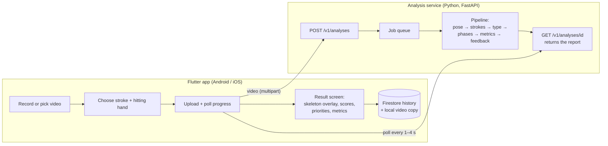
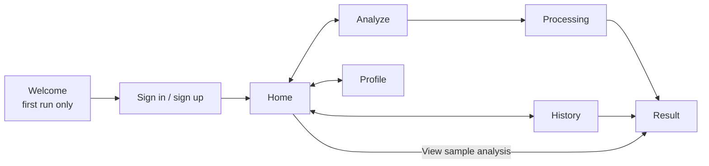

# Henry Tennis — AI tennis technique coach

Film yourself hitting a few forehands, backhands, or serves. The app finds every
stroke in the video, tracks your body in 3D, measures what a coach would look at,
and tells you the one or two changes that matter most, with a skeleton overlay on
your own video.

<p align="center"><em>Example result: 5 forehands analyzed · overall 89 · "Biggest opportunity: contact point in front"</em></p>

For each stroke you get:

- **Stroke type**: forehand, one- or two-handed backhand, slices, volleys, serve, or smash. It's detected automatically, or constrained to the stroke you say you filmed.
- **A score from 0 to 100**, plus **named metrics** such as shoulder rotation, hip–shoulder separation, knee bend, contact point, arm extension, follow-through, balance, and head stability. Serves have their own set: trophy position, toss arm, leg drive, and contact height.
- **Each metric shown against a target range**, with a plain-language explanation, a coaching cue when it's off, and a confidence badge. The badge warns you when the camera angle makes a measurement unreliable.
- **Top priorities** across the whole clip, e.g. *"Contact is late: meet the ball further in front of your front hip. Seen in 5 strokes."*

---

## Contents

1. [How it works](#1-how-it-works)
2. [Repository layout](#2-repository-layout)
3. [The analysis pipeline, step by step](#3-the-analysis-pipeline-step-by-step)
4. [The machine learning](#4-the-machine-learning)
5. [The mobile app](#5-the-mobile-app)
6. [API](#6-api)
7. [Getting started](#7-getting-started)
8. [Configuration](#8-configuration)
9. [Training and calibration](#9-training-and-calibration)
10. [Testing](#10-testing)
11. [Deployment](#11-deployment)
12. [Troubleshooting](#12-troubleshooting)
13. [Limitations and roadmap](#13-limitations-and-roadmap)
14. [Credits and licenses](#14-credits-and-licenses)

Deeper design notes, the full JSON contract, and evaluation details are in
[`docs/ARCHITECTURE.md`](docs/ARCHITECTURE.md).

---

## 1. How it works



1. **The app uploads a video** (up to 60 s) to the analysis service along with two
   options: the stroke type you filmed (or *auto-detect*) and your hitting hand.
2. **The server replies immediately with a job ID** and processes the video in the
   background. The app polls for progress: *decoding → pose → analysis → done*.
3. **The pipeline** (section 3) runs a pretrained pose model on every frame. It
   follows the main player, detects each swing, classifies it with a small model
   trained on tennis data (section 4), measures biomechanics at the right moments
   of the swing, and rates every measurement against reference ranges.
4. **The report comes back as JSON.** It holds the summary, per-stroke metrics, and
   the player's 2D skeleton for every frame, which the app draws over the video.
5. **The app saves the result.** The report goes to Firestore so history syncs
   across devices; the video copy and skeleton track stay on the phone.
   The server deletes your video as soon as analysis finishes.

---

## 2. Repository layout

```
.
├── backend/                     Python analysis service + training tools
│   ├── src/tennis_ai/
│   │   ├── api/                 FastAPI app, job queue, auth, error format
│   │   ├── pipeline/            video → pose → strokes → metrics → feedback
│   │   │   ├── video.py         decoding, fps cap, resizing
│   │   │   ├── pose.py          MediaPipe Pose Landmarker + main-player tracking
│   │   │   ├── preprocess.py    gap filling, smoothing, handedness, mirroring
│   │   │   ├── segment.py       stroke detection from wrist-speed peaks
│   │   │   ├── classify.py      learned ONNX classifier + heuristic fallback
│   │   │   ├── phases.py        key frames: backswing end, contact, finish, trophy…
│   │   │   ├── metrics.py       biomechanical metric definitions + camera-view estimate
│   │   │   ├── feedback.py      rating, scores, priorities, reference ranges
│   │   │   └── analyzer.py      orchestrates everything → AnalysisReport
│   │   ├── ml/                  dataset download, pose extraction, features,
│   │   │                        training, ONNX export, calibration
│   │   ├── data/reference_default.json   coaching-default target ranges
│   │   ├── schemas.py           API response models (the contract)
│   │   ├── config.py            settings (TENNIS_* environment variables)
│   │   └── cli.py               `tennis-ai` command
│   ├── tests/                   pytest suite (synthetic skeletons, no downloads)
│   ├── scripts/smoke_api.py     end-to-end check against a real running server
│   ├── models/                  model files (gitignored; see section 9)
│   ├── data/                    datasets, pose caches, sample clips (gitignored)
│   ├── Dockerfile
│   └── pyproject.toml
├── frontend/                    Flutter app
│   ├── lib/
│   │   ├── main.dart            Firebase + preferences bootstrap
│   │   ├── app/                 router (auth/onboarding gates), Material 3 theme
│   │   ├── core/                API client + errors, settings, providers, widgets
│   │   └── features/
│   │       ├── onboarding/      first-run intro
│   │       ├── auth/            sign in / sign up / reset password
│   │       ├── home/            dashboard: new analysis, averages, recent results
│   │       ├── analyze/         pick/record → options → upload & processing
│   │       ├── results/         report models, result screen, skeleton overlay
│   │       ├── history/         Firestore repository, on-device file store
│   │       └── profile/         hitting hand, server URL, theme, account
│   ├── assets/sample_report.json   real backend output for "View sample analysis"
│   ├── test/                    widget + unit tests (no Firebase needed)
│   ├── test_screenshots/        renders the result screen to PNGs
│   ├── firestore.rules          per-user security rules
│   └── firebase.json, .firebaserc   Firebase project wiring
├── docs/ARCHITECTURE.md         design decisions, full API contract, results
├── bootstrap.py                 one-command setup for any OS (section 7)
└── setup.sh, setup.cmd, setup.ps1   wrappers that find Python and run bootstrap.py
```

---

## 3. The analysis pipeline, step by step

All code lives in `backend/src/tennis_ai/pipeline/`.

### 3.1 Decode the video (`video.py`)

- OpenCV reads the file and applies phone rotation metadata.
- Frames are resized so the long side is at most **960 px**.
- High-frame-rate video is thinned to at most **60 fps**. A 240 fps clip keeps every 4th frame.
- Videos longer than **60 s** are rejected with `video_too_long`.

### 3.2 Estimate pose and track the player (`pose.py`)

- **Google MediaPipe Pose Landmarker** (the *heavy* model) runs on every frame in
  video mode. For each person it returns 33 landmarks:
  - 2D image positions,
  - **3D world positions in metres**, centred on the hips,
  - a visibility score per landmark.
- We keep 17 of them: nose, shoulders, elbows, wrists, hips, knees, ankles, heels, and feet.
- **Main-player tracking.** Tennis videos often contain other people (a coach, an
  opponent, someone walking past). The model detects up to 2 people per frame, and
  detections are linked into tracks by bounding-box continuity. The player is the
  track with the most *size × visibility × duration*. Fragments that continue it
  after a detection gap are stitched back on.
- 3D coordinates are converted to *x = right, y = up, z = toward camera*.

### 3.3 Clean up the motion and work out handedness (`preprocess.py`)

- Joints that are completely missing, or have near-zero visibility, are dropped.
  Gaps of up to 0.3 s are filled by linear interpolation.
- A **Savitzky–Golay filter** smooths each joint over about 0.2 s.
- All distances are expressed in **torso lengths** (shoulder midpoint to hip
  midpoint). That makes numbers comparable between a child and an adult, and
  between a close camera and a far one.
- **Handedness** comes from your profile setting if you've set one. Otherwise it's
  detected as the wrist with the higher sustained peak speed.
- **Left-handers are mirrored**: x is flipped and left/right joints are swapped. From
  here on, every stage can assume a right-handed player.

### 3.4 Detect strokes (`segment.py`)

The signal is the **hitting wrist's speed**, in torso lengths per second.

1. **Candidates.** Every local peak above an adaptive threshold becomes a candidate:
   at least 5 torso lengths/s, and at least 45% of the clip's fastest swings.
2. **Rejection.** Candidates are dropped if they are:
   - **tracking glitches**, where a left/right landmark swap makes the wrist jump back and forth with no real sweep;
   - **incompatible with the stroke you chose**. For example, a "serve" whose wrist is well below the head at contact is really a ball bounce or fidgeting;
   - **a serve's windup**: a fast non-overhead motion in the 1.8 s before an overhead stroke.
3. **Non-maximum suppression.** Among the remaining candidates, the fastest one
   within any 1.2 s window wins. That merges a high follow-through's second speed
   peak into its stroke.
4. **Windows.** Each surviving peak becomes a window from 1.2 s before contact to 0.8 s after.

Filtering happens *before* suppression on purpose: a rejected peak must never hide
a real stroke right next to it.

### 3.5 Classify each stroke (`classify.py`)

- **With a trained model** (`models/stroke_model.onnx`, section 4), a small neural
  network looks at 1.6 s of motion around contact and outputs one of 9 types:
  - `forehand`, `forehand_slice`, `forehand_volley`
  - `backhand_1h`, `backhand_2h`, `backhand_slice`, `backhand_volley`
  - `serve`, `smash`

  If you chose a stroke in the app, predictions are restricted to that family.
- **Without a model, a rule-based fallback runs:**
  - **Overhead** only if all three hold: contact is above the head, the tossing arm went up, and the racket was already high just before contact.
  - **Forehand vs backhand** from which side of the body the racket is on during the backswing.
  - **Two-handed** if both wrists stay together.

### 3.6 Find the key moments (`phases.py`)

| Stroke family | Key frames | Phases |
|---|---|---|
| Groundstrokes and volleys | **backswing end** (the wrist momentarily slows as the backswing turns into the forward swing), **contact** (peak wrist speed), **finish** | preparation → forward swing → follow-through |
| Serves and smashes | **trophy** (tossing hand at its highest), **load** (deepest knee bend), **contact** (snapped to the highest reach near peak speed), **finish** | preparation → acceleration → follow-through |

### 3.7 Measure the biomechanics (`metrics.py`)

Joint angles use the 3D world coordinates. Rotations are measured as *changes* in
the direction of the shoulder or hip line in the horizontal plane, so they don't
depend on where the camera stands.

**Groundstrokes (forehand and backhand families):**

| Metric | What it measures | When |
|---|---|---|
| Shoulder rotation | Degrees the shoulder line rotates from end of backswing to contact | forward swing |
| Hip–shoulder separation | Angle between shoulder line and hip line (the "coil") | backswing end |
| Knee bend | Deepest knee flexion while loading | preparation |
| Contact point in front | How far ahead of the hips the wrist is at contact, along the swing direction | contact |
| Hitting-arm extension | Elbow angle | contact |
| Follow-through height | Highest hitting-hand position after contact, relative to the shoulders | follow-through |
| Balance at contact | Spine angle from vertical | contact |
| Stance width | Distance between the feet | contact |
| Head stability | How much the head moves through contact | contact ± 0.15 s |
| Swing speed *(info)* | Peak hitting-wrist speed | forward swing |
| Forward swing time *(info)* | Backswing end → contact | forward swing |

**Serves and smashes:** knee bend in the load, leg drive (knee extension from load
to contact), hitting elbow height at trophy, tossing-arm extension, shoulder tilt at
trophy, contact height, hitting-arm extension at contact, follow-through across the
body, and swing speed.

**Camera view.** The view is estimated as *front / back / side / oblique*, from
shoulder width in the image and which way the nose points. Every metric then gets a
**confidence**:

- *high* by default;
- *medium* if it relies on MediaPipe's noisier depth estimate (rotations, stance width, contact depth);
- *low* from a camera angle where it can't be measured. For example, contact depth from directly behind.

Low-confidence metrics are still shown, faded, but never become priorities.

### 3.8 Rate, score, and prioritise (`feedback.py`)

1. **Reference ranges.** Each rated metric has a **good** range and a wider
   **ok** range. They can be one-sided: *"contact in front ≥ 0.25 torso lengths"*
   has no upper bound. Where they come from:
   - `data/reference_default.json`: coaching heuristics;
   - `models/reference_calibrated.json`, when present: expert-derived ranges that override the defaults (section 9).
2. **Rating.** Inside *good* → **good**, score 100. Inside *ok* → **fair**, 60–100.
   Beyond *ok* → **needs work**, 0–60, falling with distance. A cue is attached
   only on the side a coach would actually correct.
3. **Stroke score.** A weighted mean of the rated metrics. Medium-confidence metrics
   count 60%, low-confidence ones are ignored, and key metrics weigh more (contact
   point 1.5×, shoulder rotation 1.2×).
4. **Priorities.** The biggest weighted shortfalls across the clip, grouped per
   metric (e.g. *"seen in 5 strokes"*), top 3.
5. **Quality warnings**, for example:
   - frame rate below 24 fps,
   - player too small in the frame,
   - player missing in many frames,
   - handedness uncertain,
   - no swings found.

---

## 4. The machine learning

### What's pretrained and what we trained

| Component | Approach | Why |
|---|---|---|
| Body pose (2D + 3D) | **Pretrained** MediaPipe Pose Landmarker (Apache 2.0) | State-of-the-art pose models need hundreds of thousands of labelled images. General models already handle tennis players well. |
| Stroke type | **Trained by us**: a small temporal CNN on pose sequences, exported to ONNX | It's a sequence problem with labels we can get, and trains in minutes. Working on pose features instead of pixels ignores background, clothing, and lighting. |
| Feedback | **Interpretable metrics**, rated against ranges **calibrated from expert data** | A classifier can say a swing looks like a beginner's, but not *what to change*. Named metrics can. |

### Dataset: THETIS

[THETIS](https://github.com/THETIS-dataset/dataset) (Gourgari et al., CVPR Workshops 2013):

- 1,980 RGB clips of 12 shot types;
- 55 players (31 beginners, 24 experts);
- recorded indoors with a front-facing Kinect at 17–19 fps;
- one shot per clip, swung **without a ball**.

We don't use the Kinect skeleton files. We run *our own* pose pipeline on the RGB
video, so training features match what the app sends exactly.

Consistency tricks that make THETIS usable:

- **Handedness per player.** It's a majority vote over each player's forehands and
  serves, then applied to all their clips. A backhand alone is ambiguous, because
  the free arm swings fast too.
- **Label-guided windows.** A serve clip may only pick a peak that can be a serve,
  so the racket windup is never mistaken for the hit.
- **Common temporal bandwidth.** Every clip is smoothed with the same Gaussian in
  *seconds* before resampling, so 18 fps training clips and 60 fps phone videos
  produce the same velocities.

### Features and model (`ml/features.py`, `ml/model.py`)

- **Window.** 1.0 s before contact to 0.6 s after, resampled to **48 time steps**.
- **89 features per step:**
  - 13 joint positions: hip-centred, scaled by torso length, and rotated so the hip
    line at contact points along +x. This makes them independent of camera angle.
  - their velocities;
  - 8 joint angles;
  - hip–shoulder separation;
  - a "pose present" flag.
- **Network.** Four 1D convolution blocks, then average + max pooling, then two heads:
  - stroke type (9 classes);
  - expert-likeness (1 output).
- **Training.** AdamW with a one-cycle schedule and label smoothing. Augmentation
  covers random camera yaw (±30°), body scale, and contact-timing jitter.
  Validation holds out **whole players**, so it measures generalisation to new people.

### Results

On **396 strokes from held-out players**:

| | Stroke type (9 classes) | Macro-F1 | Stroke family | Expert vs beginner AUC |
|---|---|---|---|---|
| Trained model | **0.798** | 0.765 | **0.987** | 0.934 |
| Rule-based fallback | 0.649 (of the 4 types it outputs) | — | 0.755 | — |

Per-type recall:

| Type | Recall |
|---|---|
| forehand | 0.85 |
| forehand slice | 0.58 |
| forehand volley | 0.76 |
| 1H backhand | 0.97 |
| 2H backhand | 0.91 |
| backhand slice | 0.76 |
| backhand volley | 0.76 |
| serve | 0.93 |
| smash | 0.36 |

Smashes are mostly called serves, because without the ball's flight they're nearly
the same motion.

On real **on-court coaching clips** (Wikimedia Commons, 30 fps):

| Clip | Correct |
|---|---|
| Forehands | 5/5 |
| Two-handed backhands | 5/6 |
| Serves | 4/4 |
| One-handed backhands | 2/5 exact, 4/5 right family |

The expert-likeness head does **not** transfer from THETIS to real footage: it
rated a coach's own strokes as beginner-like. The server therefore leaves it out of
reports by default (`TENNIS_EXPOSE_SKILL_SCORE=false`).

---

## 5. The mobile app

Built with Flutter 3.47:

- Material 3 design;
- **Riverpod** for state (no code generation);
- **go_router** for navigation;
- **dio** for networking;
- **Firebase Auth + Cloud Firestore**.

### Screens and flow



- **Welcome.** Three intro pages, shown once.
- **Sign in / sign up.** Email and password, with password reset and friendly error messages.
- **Home.** A "New analysis" button, your average score per stroke family, recent
  results, recording tips, and **View sample analysis**, a real report bundled with
  the app.
- **Analyze.**
  1. **Record a video** (up to 60 s) or **choose one from your library**.
  2. Preview it.
  3. Pick the stroke: *Auto-detect / Forehand / Backhand / Serve*. Choosing one also
     filters out non-swing motion.
  4. Pick your hitting hand: *Auto / Right / Left*. It defaults to your profile setting.
  5. **Analyze swing.**

  A *How to film* sheet explains the best camera setup.
- **Processing.** Upload progress, then the server's stage and progress. You can
  cancel, which also deletes the job on the server.
- **Result**, the main screen:
  - **video player with the skeleton overlay** drawn from the report. If the video
    isn't on this device, you get a skeleton-only replay.
  - **timeline markers** for each detected stroke;
  - quality warnings;
  - overall **score ring**, headline, stroke counts, camera view, and handedness;
  - **top priorities**;
  - **stroke chips**: tap one to jump to it.

  For the selected stroke:
  - the type, the model's certainty, and the score;
  - metrics grouped by phase, each with a **range bar** (ok band, good band, your
    value), target text, explanation, coaching cue, and confidence badge.

  Tapping a metric seeks the video to that moment and highlights the joints involved.
- **History.** Every saved analysis, filterable by forehand, backhand, or serve.
  Swipe or use the menu to delete one.
- **Profile.** Display name, hitting hand, **analysis server URL** with a *Test
  connection* button (shows which model and ranges the server uses), light / dark /
  system theme, sign out, and delete account.

### Where the app finds the server

`lib/core/config/settings.dart` picks the URL in this order:

1. The URL saved in **Profile → Analysis server**.
2. `--dart-define=API_BASE_URL=...` at build time.
3. `http://10.0.2.2:8000` on Android, which is the emulator's alias for your computer.
4. `http://localhost:8000` on iOS.

Every request carries the user's Firebase ID token in the `Authorization` header, so
the server can require sign-in (section 11).

### What's stored where

| Data | Location | Notes |
|---|---|---|
| Analysis report (without the per-frame skeleton) | Firestore `users/{uid}/analyses/{jobId}` | Summary fields for the history list (`overallScore`, `primaryType`, `families`, `strokeCounts`, `familyScores`, `headline`, `createdAt`), plus the full report as a JSON string in `reportJson` |
| Video copy + skeleton track | Phone: `<app documents>/analyses/<jobId>/video.<ext>` and `pose_track.json` | Too large for Firestore. On another device, history still shows the full report, with a skeleton-free replay |
| Settings (theme, hand, server URL, onboarding done) | Phone: shared preferences | |
| Your uploaded video | Server | **Deleted as soon as analysis finishes.** Results are kept in memory for 1 hour for polling |

`frontend/firestore.rules` lets each signed-in user read and write **only** their
own `users/{uid}` document and everything under it.

---

## 6. API

The service exposes interactive docs at `http://localhost:8000/docs`.

| Method | Path | Purpose |
|---|---|---|
| `GET` | `/v1/health` | Status, version, and which pose model, classifier, and reference ranges are active |
| `POST` | `/v1/analyses` | Multipart upload: `file`, optional `stroke_hint` (`auto`\|`forehand`\|`backhand`\|`serve`), optional `handedness` (`auto`\|`right`\|`left`). Returns **202** with a job |
| `GET` | `/v1/analyses/{id}` | Job status (`queued` → `processing` → `done`/`failed`), `stage`, `progress` 0–1, `error`, and `result` when done |
| `DELETE` | `/v1/analyses/{id}` | Drop a job and its data |

Errors always look like `{"error": {"code": "...", "message": "..."}}`. The possible codes:

- **Input:** `unsupported_format` (415), `video_too_large` (413), `invalid_request` (422)
- **Access:** `unauthorized` (401), `not_found` (404)
- **Failed jobs:** `video_unreadable`, `video_too_long`, `no_player_detected`, `internal`

A trimmed report:

```jsonc
{
  "video":   {"duration_s": 19.0, "fps": 30.0, "width": 320, "height": 240, "frames_analyzed": 570},
  "player":  {"handedness": "right", "handedness_source": "user", "view": "oblique", "view_confidence": 0.6},
  "quality": {"score": 1.0, "warnings": []},
  "models":  {"pose": "mediapipe-pose-landmarker-heavy", "classifier": "learned:v1-20260911", "reference": "calibrated"},
  "summary": {
    "overall_score": 89, "stroke_counts": {"forehand": 5},
    "headline": "5 strokes analyzed. Biggest opportunity: contact point in front.",
    "priorities": [{"metric_id": "contact_in_front", "title": "Contact point in front",
                    "cue": "Contact is late: meet the ball further in front of your front hip.",
                    "stroke_type": "forehand", "stroke_indices": [0,1,2,3,4], "severity": "fair"}]
  },
  "strokes": [{
    "index": 0, "type": "forehand", "family": "forehand", "type_confidence": 0.9, "type_source": "model",
    "start_s": 0.2, "contact_s": 1.4, "end_s": 2.2,
    "key_frames": {"backswing_end": 0.567, "contact": 1.4, "finish": 1.833},
    "phases": [{"name": "preparation", "start_s": 0.2, "end_s": 0.567}, "…"],
    "score": 93, "skill_score": null,
    "metrics": [{
      "id": "contact_in_front", "label": "Contact point in front", "value": 0.2, "unit": "torso",
      "phase": "contact", "rating": "fair", "score": 73, "confidence": "medium",
      "reference": {"good": [0.25, null], "ok": [0.1, null], "source": "calibrated"},
      "explanation": "How far in front of your body you meet the ball…",
      "cue": "Contact is late: meet the ball further in front of your front hip.",
      "joints": ["r_wrist", "l_hip", "r_hip"]
    }, "…"]
  }],
  "pose_track": {"fps": 30.0, "joints": ["nose", "l_shoulder", "…"], "edges": [[1, 2], "…"],
                 "frames": [[0.512, 0.221, "… 34 numbers per frame"], null, "…"]}
}
```

Units:

- `deg`: degrees
- `torso`: multiples of the player's torso length
- `torso/s`: torso lengths per second
- `s`: seconds

In `pose_track`, coordinates are normalised to the displayed frame, and `null` means
no player was detected in that frame. The full schema is in
[`docs/ARCHITECTURE.md` §6](docs/ARCHITECTURE.md#6-api-contract-v1).

---

## 7. Getting started

### Quick start: one command

Install **Python 3.11 or 3.12** and **Flutter 3.47.3+**, plus Android Studio for an
emulator. Then clone and run the setup script for your OS:

```bash
git clone git@github.com:henrychen4736/CAC24.git
cd CAC24

sh setup.sh --run          # macOS / Linux
setup.cmd --run            # Windows (or double-click setup.cmd for setup only)
python bootstrap.py --run  # any OS, if you'd rather call Python directly
```

The script ([`bootstrap.py`](bootstrap.py)) does everything in section 7.2–7.4 for you:

1. **Checks your tools.** It stops with exact instructions if Python or Flutter is
   missing or too old, before changing anything.
2. **Sets up the backend.** It creates `backend/.venv`, installs the `tennis_ai`
   package, and downloads the MediaPipe pose model. Re-running also repairs the
   environment if you move or rename the project folder.
3. **Installs the trained model** if you pass `--models-from`, trains it with
   `--train`, or tells you the server will use the rule-based fallback.
4. **Installs the app's Flutter packages.**
5. **With `--run`:**
   - starts the server and waits until it's healthy;
   - picks a connected phone, or cold-boots your Android emulator if nothing is connected;
   - launches the app. On a physical phone it points the app at your computer's LAN address automatically.

   Quitting the app (`q`) also stops the server.

It's safe to re-run at any time. Other useful options:

| Command | What it does |
|---|---|
| `python bootstrap.py` | Set up only, then print how to start things |
| `python bootstrap.py --check` | Only report which tools are installed |
| `python bootstrap.py --test` | Set up, then run backend lint + tests and `flutter analyze` + tests |
| `python bootstrap.py --models-from models.zip` | Install trained model files from a folder, `.zip`, or URL |
| `python bootstrap.py --train` | Train the stroke model and calibrate ranges on THETIS (~4 GB, 1–2 h) |
| `python bootstrap.py --skip-frontend` | Server only; no Flutter needed |
| `python bootstrap.py --run --device <id>` | Launch on a specific device (`flutter devices` lists them) |
| `python bootstrap.py --flutter <path>` / `--python <path>` | Use a specific Flutter SDK or Python |
| `python bootstrap.py --deploy-rules` | Deploy the Firestore rules (needs Node.js + `npx firebase-tools login`) |

The manual steps below do the same thing, one piece at a time.

### Prerequisites

| Tool | Version | Used for |
|---|---|---|
| Python | **3.11 or 3.12** (MediaPipe has no wheels for newer versions yet) | backend |
| Flutter | **3.47.3 or newer** (Dart 3.13) | app |
| Android Studio | with an emulator image (API 35 tested) or a USB-debuggable phone | running on Android |
| Xcode 16+ and CocoaPods | on a Mac | running on iOS |
| Node.js | 18+ (for `npx firebase-tools`) | Firebase setup |

### 7.1 Clone

```bash
git clone git@github.com:henrychen4736/CAC24.git
cd CAC24
```

### 7.2 Backend

```powershell
cd backend
python -m venv .venv
.venv\Scripts\activate            # macOS/Linux: source .venv/bin/activate
pip install -e ".[dev]"
tennis-ai download-models         # MediaPipe pose model (~30 MB) → models/
tennis-ai serve                   # http://localhost:8000  (docs at /docs)
```

Check it: `curl http://localhost:8000/v1/health`.

> **Model files aren't in git.** `models/stroke_model.onnx` and
> `models/reference_calibrated.json` are build artifacts. On a fresh clone the
> health check shows `"classifier": "heuristic"` and `"reference": "default"`.
> Everything works, just with the rule-based classifier and coaching-default ranges.
> To get the trained model, run the training steps in [section 9](#9-training-and-calibration),
> or copy the two files from a machine that has them.

Try an analysis without the app:

```powershell
tennis-ai analyze path\to\clip.mp4 --handedness right --out report.json
```

### 7.3 Firebase (once per project)

The app is wired to the Firebase project **`henry-tennis-q8mkn`**:
`frontend/lib/firebase_options.dart`, `android/app/google-services.json`,
`ios/Runner/GoogleService-Info.plist`, and `.firebaserc`.

1. **Enable sign-in.** In the
   [Authentication console](https://console.firebase.google.com/project/henry-tennis-q8mkn/authentication),
   click **Get started** and enable **Email/Password**. The CLI can't do this step.
2. **Firestore.** The database already exists (location `nam5`). Deploy the security
   rules after any change to `firestore.rules`:
   ```powershell
   cd frontend
   npx -y firebase-tools@latest login
   npx -y firebase-tools@latest deploy --only firestore:rules
   ```

<details>
<summary>Using a different Firebase project</summary>

```powershell
npx -y firebase-tools@latest projects:create <project-id> --display-name "Henry Tennis"
npx -y firebase-tools@latest apps:create android "Henry Tennis Android" --package-name com.henryTennis --project <project-id>
npx -y firebase-tools@latest apps:create ios "Henry Tennis iOS" --bundle-id com.henryTennis --project <project-id>
npx -y firebase-tools@latest firestore:databases:create "(default)" --location nam5 --project <project-id>
npx -y firebase-tools@latest apps:sdkconfig ANDROID <android-app-id> --out google-services.json
npx -y firebase-tools@latest apps:sdkconfig IOS <ios-app-id> --out GoogleService-Info.plist
```

Then:

1. Copy the two config files into `frontend/android/app/` and `frontend/ios/Runner/`.
2. Update the values in `frontend/lib/firebase_options.dart`.
3. Set the project ID in `.firebaserc` and `firebase.json`.
4. Enable Email/Password sign-in, then deploy the rules.

If the database creation fails with "Cloud Firestore API has not been used", run the
rules deploy once (it enables the API), wait a minute, and retry.
</details>

### 7.4 App

```powershell
cd frontend
flutter pub get
flutter emulators --launch Medium_Phone_API_35    # or plug in a phone
flutter run
```

- **Android emulator:** nothing else to configure. The app talks to your computer at `10.0.2.2:8000`.
- **Physical phone on the same Wi-Fi:**
  ```powershell
  ipconfig                                           # find your IPv4, e.g. 192.168.1.20
  flutter run --dart-define=API_BASE_URL=http://192.168.1.20:8000
  ```
  Or set it later in **Profile → Analysis server** and press **Test connection**. On
  Windows, allow Python through the firewall on private networks.
- **iOS (on a Mac):** `cd ios && pod install && cd ..`, then `flutter run -d <device>`.

Plain HTTP is allowed for development:

- debug Android builds allow any host;
- release builds only allow `10.0.2.2` and `localhost`;
- iOS allows local-network hosts.

Put the server behind HTTPS for real users.

---

## 8. Configuration

### Backend (`TENNIS_*` environment variables, or `backend/.env`)

| Variable | Default | Meaning |
|---|---|---|
| `TENNIS_POSE_MODEL` | `heavy` | `lite` / `full` / `heavy`: speed vs accuracy |
| `TENNIS_MAX_VIDEO_SECONDS` | `60` | longer uploads fail with `video_too_long` |
| `TENNIS_MAX_UPLOAD_MB` | `300` | larger uploads get HTTP 413 |
| `TENNIS_MAX_SIDE_PX` | `960` | frames are downscaled to this long side |
| `TENNIS_MAX_FPS` | `60` | higher frame rates are thinned |
| `TENNIS_WORKERS` | `1` | concurrent analyses |
| `TENNIS_JOB_TTL_SECONDS` | `3600` | how long finished jobs stay available for polling |
| `TENNIS_AUTH_REQUIRED` | `false` | require a Firebase ID token (`pip install -e ".[auth]"`) |
| `TENNIS_FIREBASE_PROJECT_ID` | — | e.g. `henry-tennis-q8mkn`; used to verify tokens |
| `TENNIS_EXPOSE_SKILL_SCORE` | `false` | include the expert-likeness score (not validated on real footage) |
| `TENNIS_MODELS_DIR` | `backend/models` | where model files live |
| `TENNIS_UPLOAD_DIR` | `backend/uploads` | temporary upload location |

**Speed.** On a laptop CPU the heavy pose model processes about 10–15 frames per
second: a 10 s clip at 30 fps takes roughly 25 s. `TENNIS_POSE_MODEL=full` is about
2× faster.

### App

| Setting | How |
|---|---|
| Analysis server URL | `--dart-define=API_BASE_URL=...`, or Profile → Analysis server |
| Default hitting hand | Profile |
| Theme | Profile (system / light / dark) |
| Firebase project | `lib/firebase_options.dart` + native config files |

---

## 9. Training and calibration

Everything runs from `backend/` with `pip install -e ".[train]"` (adds PyTorch, onnx).

```powershell
tennis-ai fetch-thetis --out data/thetis            # 1,980 clips, ~4 GB
tennis-ai extract --thetis data/thetis --out data/poses
tennis-ai train --poses data/poses --out models
tennis-ai calibrate --poses data/poses --view front --shadow --out models/reference_calibrated.json
```

| Step | What it does | Time (8-core laptop) |
|---|---|---|
| `fetch-thetis` | Downloads the RGB clips, writes `data/thetis/manifest.csv` | depends on network |
| `extract` | Runs the pose model on every clip **once** and caches `data/poses/*.npz`. Features and metrics are recomputed from this cache, so changing that code never re-runs pose | ~75 min |
| `train` | Builds features, splits by player, trains, prints accuracy / F1 / per-class recall / confusion matrix / heuristic baseline, refits on all data, exports `models/stroke_model.onnx` + `.json` | ~10–15 min on CPU |
| `calibrate` | Takes the distribution of each metric over **expert** strokes and sets *good* = 15th–85th percentile and *ok* = 3rd–97th, keeping the defaults' open-ended sides | ~3 min |

**Calibration only trusts measurements that make sense for the dataset.**

- **`--view front`** tells it THETIS's camera faced the player. Depth-dependent
  metrics (rotations, stance width, contact depth) aren't trustworthy from there,
  so they keep their coaching defaults.
- **`--shadow`** says the clips have no ball, so leg drive keeps its default.
  Expert shadow serves barely drive up into a ball that isn't there.

Restart the server after training; it picks up the new files automatically.

### Bring your own clips

Any folder of clips plus a CSV manifest works in place of `--thetis`:

```csv
video,stroke,skill,player,handedness,view
clips/amy_fh_01.mp4,forehand,expert,amy,right,side
clips/bob_serve_03.mov,serve,beginner,bob,,back
```

```powershell
tennis-ai extract --manifest my_clips/manifest.csv --out data/my_poses
tennis-ai train --poses data/my_poses --out models
tennis-ai calibrate --poses data/my_poses --out models/reference_calibrated.json
```

- `stroke` uses the 9 type names above.
- `skill` is `expert` / `beginner`, or blank.
- `player` keeps each person's clips on one side of the train/validation split.
- `handedness` and `view` are optional.

On-court clips filmed from the side or behind are the most valuable data you could add.

---

## 10. Testing

```powershell
# backend (37 tests; synthetic skeletons, no video or model downloads)
cd backend; .venv\Scripts\activate
ruff check src tests scripts
pytest

# app (41 tests; no Firebase needed)
cd frontend
flutter analyze
flutter test
```

- **Backend tests** cover:
  - stroke detection, including serve windups and ball bounces;
  - handedness mirroring and heuristic classification;
  - invariance of features and rotation metrics to camera angle and frame rate;
  - rating and priorities;
  - the full HTTP job flow, including auth and error formats;
  - dataset building, training → ONNX export → serving, and calibration rules.
- **App tests** cover:
  - report parsing, including one-sided ranges;
  - API error mapping;
  - skeleton-overlay coordinate mapping and the playback clock;
  - router redirects;
  - the result screen.
- **End-to-end against a real server:**
  `python scripts/smoke_api.py path\to\clip.mp4 --hint serve`. It starts the server,
  uploads, polls, prints the result, and deletes the job.
- **Screenshots without a device:**
  `flutter test test_screenshots/result_screen_screenshot_test.dart` writes the
  result screen to `frontend/build/screenshots/*.png`.

---

## 11. Deployment

`backend/Dockerfile` builds a CPU image that listens on `$PORT`. It suits Google Cloud Run:

```bash
cd backend
docker build -t henry-tennis-api .
docker run -p 8080:8080 \
  -e TENNIS_AUTH_REQUIRED=true \
  -e TENNIS_FIREBASE_PROJECT_ID=henry-tennis-q8mkn \
  henry-tennis-api
```

- Copy trained files into `backend/models/` before building so they're baked into the image.
- **Jobs are kept in memory**, so run a single instance. To scale out, move the job
  store to Firestore or Redis and the queue to Cloud Tasks.
- Turn on `TENNIS_AUTH_REQUIRED` for anything public. The app already sends Firebase ID tokens.
- Serve over HTTPS, and point the app at it with `--dart-define=API_BASE_URL=https://…`.
- Release builds are still signed with the debug key. Add a signing config in
  `frontend/android/app/build.gradle.kts` before publishing.

> The Dockerfile has not been built on the development machine, which has no Docker.

---

## 12. Troubleshooting

| Problem | Fix |
|---|---|
| **App can't reach the server** ("Can't reach the analysis server") | Check the server is running (`/v1/health`). The emulator must use `http://10.0.2.2:8000`, not `localhost`. A phone needs your computer's LAN IP, the same Wi-Fi, and Python allowed through the Windows firewall. Use **Profile → Test connection**. |
| **Sign-up fails** | Email/Password sign-in isn't enabled in the Firebase console (section 7.3). |
| **Android emulator closes right after starting**, log shows `WHPX: Unexpected VP exit code 4` | The saved quick-boot snapshot is incompatible. Cold boot: `emulator -avd Medium_Phone_API_35 -no-snapshot-load`, or in Android Studio's Device Manager choose *Cold Boot Now*. |
| Log spam: `GoogleApiManager … SecurityException: Unknown calling package name 'com.google.android.gms'` | Harmless on emulators; Google Play services noise. It doesn't affect sign-in or Firestore. |
| `flutter pub get` complains about the SDK version | The app needs Flutter ≥ 3.47.3. Run `flutter upgrade`. |
| `pip install` fails on mediapipe | Use Python 3.11 or 3.12. |
| "No swings detected" | Keep the whole body in frame. Film from the side or behind, at ≥ 30 fps (60 is best). Choose the stroke type in the app. |
| Phantom strokes (ball bounces counted as swings) | Choose the stroke type instead of *Auto-detect*. That filters motion that can't be that stroke. |
| Analysis is slow | Set `TENNIS_POSE_MODEL=full`, shorten the clip, or run the server on a faster machine. |
| Health check shows `classifier: heuristic` | The trained model files aren't in `backend/models/`. See section 9. |

---

## 13. Limitations and roadmap

- **Monocular 3D is approximate.** Depth is estimated from a single camera, so
  rotation and contact-depth metrics are marked medium or low confidence.
- **Racket and ball aren't tracked.** Contact is estimated from peak wrist speed. A
  ball/racket detector would give exact contact frames and let the app judge shot outcome.
- **The training data is indoor shadow swings** at 18 fps. The model is weakest on
  one-handed backhands, slices vs volleys, and smash vs serve. On-court clips in the
  bring-your-own format are the best next investment, plus a *"not a stroke"* class
  to reject ball bounces in auto mode.
- **The expert-likeness score** is disabled until it's validated on real footage.
- **Players far away in the frame** get poor keypoints. A crop-and-zoom pass around
  the tracked player would help.
- **Language feedback.** Cues are templated. An LLM layer could turn the metric table
  into a short personal coaching paragraph.

---

## 14. Credits and licenses

- **Pose estimation:** [MediaPipe Pose Landmarker](https://ai.google.dev/edge/mediapipe/solutions/vision/pose_landmarker) by Google (Apache 2.0).
- **Training data:** THETIS. S. Gourgari, G. Goudelis, K. Karpouzis, S. Kollias, *"THETIS: Three Dimensional Tennis Shots — A human action dataset"*, CVPR Workshops 2013. The authors provide it for **research purposes**, so treat models trained on it as research artifacts and retrain on data you have rights to before any commercial release.
- **Sample analysis in the app:** pose data derived from *"Drive con pelota.ogv"* by Dardo 86 7, Wikimedia Commons, [CC BY-SA 3.0](https://creativecommons.org/licenses/by-sa/3.0).
