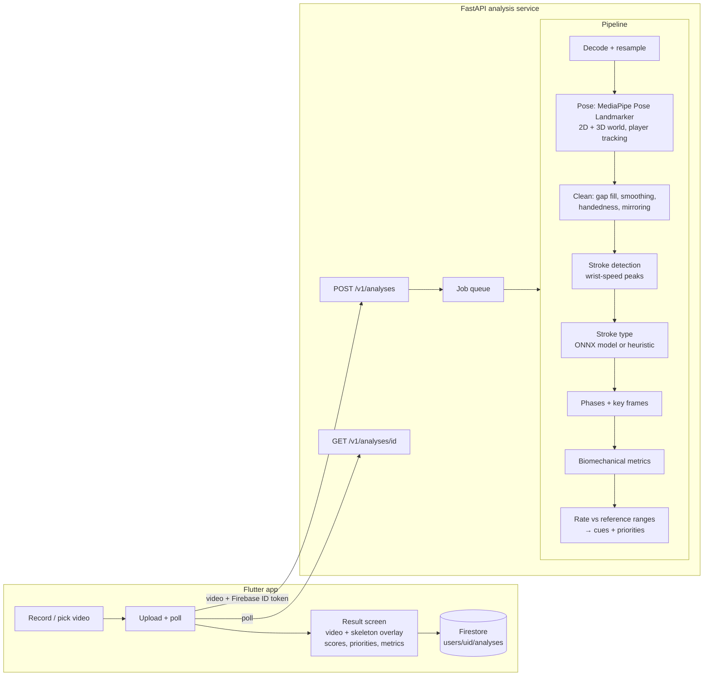

# Henry Tennis — Architecture (v2)

A mobile app that takes a video of someone playing tennis and returns specific,
actionable feedback on their technique.

This document records the v2 redesign: what changed, why, and the contracts the
app and the analysis service agree on.

---

## 1. What changed and why

| Area | v1 (before) | v2 (now) | Why |
|---|---|---|---|
| App framework | Flutter 3.24, Material 2 styling, ad-hoc `setState` screens, hard-coded server URL | Flutter (current stable), Material 3, Riverpod, go_router, typed API client | Keep Flutter: one codebase for iOS + Android, mature video/camera plugins, the existing Firebase setup carries over. The problems were structure and UX, not the framework. |
| Server | Two Flask apps (`server.py` on :5000 used by the app, `main.py` on :5001), synchronous request that blocks for minutes | One FastAPI service, async job API (upload → poll), OpenAPI schema | Mobile uploads of 10–60 s videos need progress + retry; one service, one contract. |
| Pose model | MediaPipe *legacy* `mp.solutions.pose` (removed in mediapipe 1.x), 2D image angles, pose run twice per frame | MediaPipe **Pose Landmarker (Tasks API)**, heavy model, VIDEO mode, 2D + **3D world landmarks**, multi-person with player tracking | 3D world coordinates make joint angles independent of camera angle → removes the "back view only" limit. |
| "ML model" | LSTM trained only on positive (forehand) examples → always outputs ≈1; "joint similarity" was the mean of raw pixel coordinates | Small multi-task temporal CNN on pose sequences (stroke type + expert-likeness), trained on THETIS, exported to ONNX. Heuristic fallback when no model is present. | A classifier trained on one class learns nothing. The new model has real labels (12 THETIS classes, 55 players, beginner/expert). |
| Feedback | "% similar" per joint against a bag of random frames from one pro video | Stroke detection → phase detection → **biomechanical metrics** (shoulder rotation, hip–shoulder separation, knee bend, contact point, extension, finish, balance…) → rated against reference ranges → **coaching cues + top priorities** | "Your elbow is 71 % similar" is not actionable. "Contact is late: meet the ball ~a forearm's length in front of your front hip" is. |
| Strokes | forehand, backhand, kick serve (user must pick) | forehand, backhand (1H/2H), slice variants, volleys, serve, smash; auto-detected, multiple strokes per video | THETIS covers 12 shot classes. |
| Overlay | Server re-encoded an annotated MP4 with `mp4v` (often unplayable on iOS/Android) | Server returns per-frame 2D keypoints; the app draws the skeleton over the original video | Cheaper, no codec problems, interactive (toggle, highlight problem joints). |
| History | Firestore reads existed but nothing ever wrote them | App saves every finished report to `users/{uid}/analyses` (+ security rules) | History actually works. |

---

## 2. System overview



---

## 3. The modeling decision

**Question:** keep using a pretrained pose estimator, train our own, or just fix
parts of the pipeline?

**Decision: keep a pretrained pose estimator, train small models *on top of* its
output, and generate feedback from interpretable biomechanics.**

1. **Don't train a pose estimator.** State-of-the-art pose models are trained on
   hundreds of thousands of labelled images. We have no keypoint labels, and
   general-purpose models already handle tennis players well. The upgrade that
   matters is 2D → 3D (world landmarks), which the pretrained model provides.
2. **Do train on pose sequences.** Stroke classification and "does this look like
   an expert's swing" are sequence problems with labels we *can* get
   (THETIS: 12 shot classes, beginner vs expert). A small temporal CNN over
   ~90 pose features per frame trains in minutes and runs in milliseconds.
   Training on pose features instead of pixels also makes the model far less
   sensitive to background, clothing, and lighting, which matters because
   THETIS is indoor footage and users film outdoors.
3. **Feedback comes from biomechanical metrics, not a black box.** A classifier
   can tell you a swing looks like a beginner's; it can't tell you *what to
   change*. We compute named metrics at the right moments of the stroke and compare
   them to reference ranges. Every number the user sees has a definition and a
   coaching cue attached. Reference ranges start as coaching heuristics
   (`source: "default"`) and are **recalibrated from expert data**
   (`source: "calibrated"`) with one command once a dataset is available.

---

## 4. Pipeline

All geometry is computed on a canonical skeleton of 17 joints:

```
0 nose       1 l_shoulder  2 r_shoulder  3 l_elbow   4 r_elbow
5 l_wrist    6 r_wrist     7 l_hip       8 r_hip     9 l_knee
10 r_knee    11 l_ankle    12 r_ankle    13 l_heel   14 r_heel
15 l_foot    16 r_foot
```

| # | Stage | Details |
|---|---|---|
| 1 | Decode | OpenCV (rotation metadata applied), resize long side ≤ 960 px, cap at 60 fps and `MAX_VIDEO_SECONDS`. |
| 2 | Pose | MediaPipe Pose Landmarker (heavy), VIDEO mode, `num_poses=2`. The target player is the largest, most persistent person. We then follow them frame to frame by bounding-box continuity, so a coach or an opponent can't hijack the track. Outputs 2D (normalized image) + 3D world (metres, hip-centred) + visibility. |
| 3 | Clean | Linear gap-fill (≤ 0.3 s), Savitzky–Golay smoothing, torso-length normalization. **Handedness** = the wrist with the higher sustained peak speed (or the user's profile setting). Left-handers are **mirrored** so all later stages assume a right-handed player. |
| 4 | Stroke detection | Signal: hitting-wrist speed in torso lengths per second. Every local peak above an adaptive threshold is a candidate. Candidates are dropped if they are tracking glitches (lots of wrist path, no net sweep) or can't be the stroke the user said they filmed (e.g. a "serve" whose contact is below the head: ball bounces, fidgeting). Then non-maximum suppression keeps the strongest peak within any 1.2 s, which merges a high follow-through's second peak into its stroke. Filtering *before* suppression matters: a rejected peak must not hide a real stroke next to it. |
| 5 | Stroke type | ONNX multi-task model if present (`models/stroke_model.onnx`), else heuristic: **overhead** only if contact is high *and* the tossing arm went up *and* the racket was already high just before contact (a one-handed backhand's high finish fails the last two); **forehand vs backhand** from which side of the body the racket is on during the backswing (0.8–0.25 s before contact — near contact a backhand crosses over); **two-handed** if the wrists stay together. A user-supplied family hint (`forehand`/`backhand`/`serve`) constrains the choice. |
| 6 | Phases | Groundstrokes: `backswing_end` (wrist-speed minimum before contact), `contact`, `finish`. Overheads: `trophy` (tossing hand at its highest), `load` (deepest knee bend), `contact`, `finish`. |
| 7 | Metrics | See table below. Angles use 3D world coordinates. Rotations are measured as *changes* of the shoulder/hip line direction in the horizontal plane, so they don't depend on where the camera stands. |
| 8 | Feedback | Each metric is rated against its reference range → `good` / `fair` / `needs_work` (+ 0–100 score). Metrics that are unreliable from the detected camera view get `confidence: low` and are never used as priorities. Stroke score = weighted mean; top priorities = worst weighted deficits, grouped across strokes. |

### Metrics

Groundstrokes (forehand / backhand families):

| id | What it measures | Moment |
|---|---|---|
| `shoulder_rotation` | Degrees the shoulder line rotates from end of backswing to contact | backswing → contact |
| `hip_shoulder_separation` | Shoulder line vs hip line angle ("coil") | backswing end |
| `knee_flexion` | Deepest knee bend while loading | backswing |
| `contact_in_front` | Hitting wrist ahead of hip centre along the swing direction (torso lengths) | contact |
| `contact_elbow_angle` | Hitting-arm extension | contact |
| `finish_height` | Hitting wrist height above shoulders at the finish (torso lengths) | finish |
| `trunk_lean` | Spine angle from vertical | contact |
| `stance_width` | Ankle distance (torso lengths) | contact |
| `head_stability` | Head movement through contact (torso lengths) | contact ± 0.15 s |
| `swing_speed` | Peak hitting-wrist speed (torso lengths/s) | forward swing |

Overheads (serve / smash):

| id | What it measures | Moment |
|---|---|---|
| `knee_flexion` | Deepest knee bend in the load | load |
| `leg_drive` | Knee extension from load to contact | load → contact |
| `trophy_elbow_height` | Hitting elbow relative to shoulder line | trophy |
| `toss_arm_extension` | Tossing-arm elbow angle | trophy |
| `shoulder_tilt` | Shoulder line vs horizontal ("shoulder over shoulder") | trophy |
| `contact_height` | Hitting wrist above head (torso lengths) | contact |
| `contact_elbow_angle` | Hitting-arm extension | contact |
| `finish_across` | Hitting wrist finishes across the body | finish |
| `swing_speed` | Peak hitting-wrist speed | acceleration |

---

## 5. Data

### THETIS (open, research use)

- 1,980 RGB clips; 55 players (p1–p31 beginners, p32–p55 experts); 12 shot
  classes; indoor, Kinect RGB 640×480; one stroke per clip, no ball.
- Source: <https://github.com/THETIS-dataset/dataset>. No license file; the
  authors describe it as "freely available for research purposes", and the paper
  must be cited. **Treat models trained on THETIS as research artifacts.**
  Before shipping commercially, retrain on data you have rights to (the
  bring-your-own format below).
- We ignore the Kinect skeleton files. Those are `.avi` renderings, not
  coordinates, and a different skeleton than we use at inference anyway. Instead
  we run *our own* pose pipeline on the RGB clips, so training and inference
  features match exactly.
- Handedness is decided **per player**, by majority vote over that player's
  forehand and serve clips, then applied to all of their clips. Backhands alone
  are ambiguous because the free arm swings fast too. Most THETIS players come
  out left-handed, which fits Kinect's mirrored RGB stream. Because everything
  is canonicalized to a right-handed player before features are computed,
  that doesn't affect training.

Class mapping (THETIS → app):

| THETIS | app `type` | family |
|---|---|---|
| forehand_flat, forehand_openstands | `forehand` | forehand |
| forehand_slice | `forehand_slice` | forehand |
| forehand_volley | `forehand_volley` | forehand |
| backhand | `backhand_1h` | backhand |
| backhand2hands | `backhand_2h` | backhand |
| backhand_slice | `backhand_slice` | backhand |
| backhand_volley | `backhand_volley` | backhand |
| flat_service, kick_service, slice_service | `serve` | overhead |
| smash | `smash` | overhead |

### Bring your own data

Any folder of clips plus a CSV manifest works:

```csv
video,stroke,skill,player,handedness,view
clips/amy_fh_01.mp4,forehand,expert,amy,right,side
clips/bob_serve_03.mov,serve,beginner,bob,,back
```

`stroke` uses the app types above. `skill` is `expert`/`beginner`, or empty.
`player` is used to split train/validation by person. `handedness` is optional
and auto-detected if blank. `view` is the camera position (`front`/`back`/`side`)
and is optional. Calibration trusts it over per-clip estimates, because a player
turning sideways mid-swing makes any camera look "oblique". Clips can contain several strokes; the extractor uses
the fastest one unless you trim them.

### Training workflow

```bash
tennis-ai fetch-thetis --out data/thetis              # ~4 GB RGB only
tennis-ai extract --thetis data/thetis --out data/features
tennis-ai train --features data/features --out models/
tennis-ai calibrate --poses data/poses --view front --shadow --out models/reference_calibrated.json
```

Calibration only uses measurements that are trustworthy for the dataset.
- **Camera position.** THETIS is filmed from the front, so rotations, stance
  width and contact depth keep their coaching defaults.
- **Ball contact.** THETIS swings have no ball (`--shadow`), so leg drive keeps
  its default. Expert shadow serves barely drive up (15th percentile ≈ 3°),
  and calibrating on them would switch that cue off.

What gets expert-derived ranges: knee bend, arm extension, heights, balance,
head stability, and serve mechanics.

Two things keep THETIS features consistent with phone videos:
- **Per-player handedness** (above).
- **A common temporal bandwidth.** THETIS runs at 17–19 fps and phones at
  30–60 fps, so every clip is smoothed with the same Gaussian, in seconds,
  before its features are resampled. The same swing then produces the same
  velocities at training time and inference time.

The service automatically uses `models/stroke_model.onnx` and
`models/reference_calibrated.json` when they exist.

---

## 6. API contract (v1)

Base URL is configurable in the app. When `AUTH_REQUIRED=true` every request
needs `Authorization: Bearer <Firebase ID token>`.

| Method | Path | Purpose |
|---|---|---|
| `GET` | `/v1/health` | Service status and which models are active |
| `POST` | `/v1/analyses` | Multipart upload: `file` (video), optional `stroke_hint` (`auto`\|`forehand`\|`backhand`\|`serve`), optional `handedness` (`auto`\|`right`\|`left`). Returns **202** with a job. |
| `GET` | `/v1/analyses/{id}` | Job status, progress, and (when done) the report |
| `DELETE` | `/v1/analyses/{id}` | Drop a job and its data |

### Job

```jsonc
{
  "id": "4f1c…",
  "status": "processing",          // queued | processing | done | failed
  "stage": "pose",                 // queued | decoding | pose | analysis | done
  "progress": 0.42,                // 0..1
  "created_at": "2026-09-10T18:30:00Z",
  "error": null,                   // {"code": "...", "message": "..."} when failed
  "result": null                   // AnalysisReport when done
}
```

Error codes: `video_unreadable`, `video_too_long`, `video_too_large`,
`unsupported_format`, `no_player_detected`, `internal`.

HTTP-level errors (the request itself is rejected) use the same shape in the
response body, with the HTTP status carrying the class of failure:

```jsonc
// 401 unauthorized · 404 not_found · 413 video_too_large · 415 unsupported_format · 422 invalid_request
{"error": {"code": "video_too_large", "message": "Videos must be under 300 MB."}}
```
A video where a player is found but no swing is detected is **not** a failure:
it returns `done` with `strokes: []` and a `no_strokes` warning.

### AnalysisReport

```jsonc
{
  "version": "2.0",
  "video":   {"duration_s": 8.2, "fps": 30.0, "width": 1280, "height": 720, "frames_analyzed": 246},
  "player":  {"handedness": "right", "handedness_source": "detected", "view": "back", "view_confidence": 0.8},
  "quality": {"score": 0.9, "warnings": [{"code": "low_fps", "message": "…"}]},
  "models":  {"pose": "mediapipe-pose-landmarker-heavy", "classifier": "heuristic", "reference": "default"},
  "summary": {
    "overall_score": 71,                          // null when no strokes
    "stroke_counts": {"forehand": 3, "backhand_2h": 1},
    "headline": "4 strokes analyzed. Biggest opportunity: contact point.",
    "priorities": [
      {"metric_id": "contact_in_front", "title": "Contact point in front",
       "cue": "Meet the ball further in front of your front hip.",
       "stroke_type": "forehand", "stroke_indices": [0, 2], "severity": "needs_work"}
    ]
  },
  "strokes": [
    {
      "index": 0,
      "type": "forehand",             // forehand | forehand_slice | forehand_volley | backhand_1h | backhand_2h
                                      // | backhand_slice | backhand_volley | serve | smash
      "family": "forehand",           // forehand | backhand | overhead
      "type_confidence": 0.86,
      "type_source": "heuristic",     // heuristic | model | user
      "start_s": 1.10, "contact_s": 1.93, "end_s": 2.50,
      "key_frames": {"backswing_end": 1.52, "contact": 1.93, "finish": 2.31},
      "phases": [
        {"name": "preparation",   "start_s": 1.10, "end_s": 1.52},
        {"name": "forward_swing", "start_s": 1.52, "end_s": 1.93},
        {"name": "follow_through","start_s": 1.93, "end_s": 2.50}
      ],
      "score": 68,
      "skill_score": null,            // P(expert-like) from the learned model; null unless
                                      // TENNIS_EXPOSE_SKILL_SCORE=true (see §8)
      "metrics": [
        {
          "id": "contact_in_front", "label": "Contact point in front",
          "value": 0.08, "unit": "torso", "phase": "contact",
          "rating": "needs_work",     // good | fair | needs_work | info
          "score": 35,                // 0..100, null for info
          "confidence": "high",       // high | medium | low
          "reference": {"good": [0.3, 0.9], "ok": [0.15, 1.1], "source": "default"},
          "explanation": "How far in front of your body you meet the ball.",
          "cue": "Meet the ball further in front of your front hip.",   // null when good
          "joints": ["r_wrist", "l_hip", "r_hip"]
        }
      ]
    }
  ],
  "pose_track": {
    "fps": 30.0,
    "joints": ["nose", "l_shoulder", "…"],
    "edges": [[1, 2], [1, 3], "…"],
    "frames": [[0.512, 0.221, 0.498, 0.301, "… 34 numbers"], null, "…"]
    // one entry per analyzed frame, frame i is at t = i / fps.
    // x,y are normalized to the displayed (rotation-corrected) video frame.
    // null = no player detected in that frame.
  }
}
```

Units: `deg`, `torso` (multiples of the player's torso length, which makes
distances comparable across players and camera distances), `torso/s`, `s`.

---

## 7. App structure

```
frontend/lib/
  main.dart                 bootstrap (Firebase, ProviderScope)
  app/                      router, theme, bootstrap
  core/                     api client, config, formatting, shared widgets
  features/
    onboarding/             first-run recording tips
    auth/                   sign in / sign up / reset password
    home/                   dashboard: new analysis CTA, recent results, progress
    analyze/                pick/record → options → upload & processing
    results/                report models, result screen, skeleton overlay painter
    history/                Firestore-backed list with filters
    profile/                handedness, server URL, theme, sign out, delete account
```

- **State:** Riverpod (no code generation).
- **Navigation:** go_router with a `StatefulShellRoute` for the bottom
  navigation bar and an auth redirect.
- **Networking:** dio (upload progress), Firebase ID token attached to every request.
- **Persistence:** Firestore `users/{uid}/analyses/{id}` holds the report minus
  `pose_track`. The pose track and a copy of the video stay on the device so
  results can be replayed with the overlay.

---

## 8. Results (September 2026)

### THETIS

**Pose extraction.** All 1,980 clips were processed with 0 failures, and the
player was visible in 99.4% of frames (heavy model, about 75 minutes on 8 CPU
workers).

**Stroke classifier.** Validation uses 396 strokes from held-out players the
model never saw. The model is `models/stroke_model.onnx`, 9 classes.

| | Stroke type | Macro-F1 | Stroke family | Expert vs beginner (AUC) |
|---|---|---|---|---|
| Learned model | **0.798** | 0.765 | **0.987** | 0.934 |
| Heuristic fallback (same players) | 0.649* | — | 0.755 | — |

\* on the 4 types it can output (forehand, 1H/2H backhand, serve).

Recall by type:

| Type | Recall |
|---|---|
| Forehand | 0.85 |
| Forehand slice | 0.58 |
| Forehand volley | 0.76 |
| Backhand 1H | 0.97 |
| Backhand 2H | 0.91 |
| Backhand slice | 0.76 |
| Backhand volley | 0.76 |
| Serve | 0.93 |
| Smash | 0.36 |

The main confusions:
- **Smash → serve.** Without the ball's flight the two are nearly the same motion.
- **Forehand slice ↔ forehand volley.**
- **Backhand slice ↔ backhand volley.**

Family errors are rare, and the family is what decides which metrics apply.

The 0.93 expert/beginner AUC is THETIS-internal, and it does **not** carry over
to real footage. On the on-court coaching drills below, the model rated the
coach's strokes as beginner-like. Experts and beginners in THETIS may simply
differ in recording session, or the shadow-swing domain may not transfer. The
service therefore leaves `skill_score` out of reports by default
(`TENNIS_EXPOSE_SKILL_SCORE=false`). Turn it on only after validating it on
on-court clips with known skill levels.

**Stroke detection.** Each THETIS clip contains one stroke. Automatic mode, no
stroke hint:

| Strokes found | Share of clips |
|---|---|
| Exactly 1 | 71% |
| 0 | 12% (mostly slow shadow volleys and slices under the speed threshold) |
| 2 or more | 17% |

**Calibration.** 17 ranges come from 864 expert clips. The rest keep their
coaching defaults for the camera-position and shadow-swing reasons in §5.

### Real on-court clips (Wikimedia Commons coaching drills, 30 fps)

Automatic mode, handedness set to right:

| Clip | Real strokes | Classified correctly |
|---|---|---|
| Forehand drill | 5 | 5/5 |
| Two-handed backhand drill | 6 | 5/6 |
| One-handed backhand drill | 5 | 2/5 exact, 4/5 right family |
| Serve drill | 4 | 4/4, plus 4 extra detections from ball bounces and the ready position |

With the matching stroke hint (what the app sends when the user picks a
stroke), the serve drill yields exactly its 4 serves. The one-handed backhand
drill yields 5 backhands.

## 9. Known limitations and roadmap

- **Automatic mode picks up non-swings.** Ball bounces and fidgeting between
  points can be detected as strokes when no stroke type is chosen. Choosing the
  stroke in the app removes almost all of them. The model has no "not a stroke"
  class because THETIS has no negatives. Adding one from a few hundred
  between-points clips is the fix.
- **Real footage differs from THETIS.** THETIS is indoor shadow swings at 18 fps.
  The one-handed backhand drill above shows the gap. On-court clips in the
  bring-your-own format (§5) are the most valuable next dataset.

- **Monocular 3D is approximate.** MediaPipe's depth estimate is noisy for fast,
  self-occluded arms. Metrics that depend on depth are flagged `confidence: low`
  from views where that axis points at the camera. Side or back views at 60 fps
  with the whole body in frame give the best results.
- **Racket and ball are not tracked.** Contact is estimated from peak wrist
  speed. A racket/ball detector (e.g., a fine-tuned YOLO on tennis footage)
  would give exact contact frames and shot outcome.
- **Far players.** A player far away in the frame (< ~25 % of frame height) gets
  poor keypoints. A crop-and-zoom pass around the tracked player is the next
  improvement.
- **THETIS domain gap.** Indoor shadow swings without a ball. The heuristic
  classifier works without it; the learned model and calibrated ranges get
  better with on-court data in the bring-your-own format.
- **Language feedback.** Metric cues are templated. An LLM layer that turns the
  metric table into a short coaching paragraph is a natural next step.
